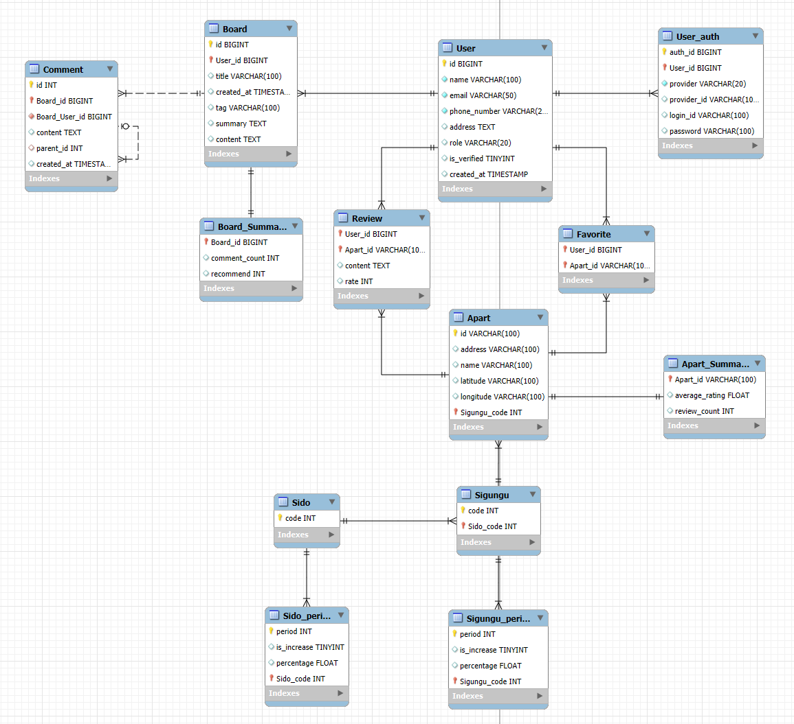

🏠 **APTrend 제안서**

---

👥 **팀원**: 곽승준, 조영빈  
📅 **버전**: v1.0 (2025.05.15)

---

## 📌 개요
**APTrend**는 아파트 거래 정보를 직관적으로 시각화하고, 데이터 기반으로 미래 시세를 예측하며, 실거주자 리뷰를 기반으로 입주민 중심의 정보를 제공하는 **부동산 통합 정보 플랫폼**입니다.

---

## 🧩 주요 기능

### 1. 🔐 로그인 / 로그아웃 / 회원가입 (곽승준)
- 일반 회원가입 / 소셜 로그인(Google, Kakao, Naver 등) 지원
- 사용자 인증 등급에 따라 리뷰 작성 및 열람 범위 제어
- 실거주 인증 기능 제공 → 리뷰 신뢰도 확보

---

### 2. 📰 최신 부동산 이슈 게시판 (곽승준)
- 관리자만 등록 가능
  - AI가 웹서칭하여 **주간 최신 리포트 자동 작성 및 게시**
- 일반 사용자는 조회만 가능

> AI 흐름:
> 1. 웹/뉴스 크롤링 → 2. NLP 요약 → 3. 리포트 생성 → 4. 게시판 자동 등록

---

### 3. 🗺️ 아파트 거래 정보 지도 시각화 (조영빈)
- 공공 API 연동 → 실거래가 수집
- 지도 상 아파트 마커 표시  
  - 전월대비 상승: 🔴  
  - 전월대비 하락: 🔵  
  - 변동폭 클수록 색 진하게
- **지도 축적 변화 시 자동 전환**  
  - 줌 아웃 시 동/구 단위 지역 변동 요약 표시
- 마커 클릭 시 팝업 → 리뷰, 거래 동향 바로 연결

---

### 4. 📈 아파트 거래 동향 분석 (조영빈)
- 거래가 시계열 그래프 시각화
- Python 기반 예측 모델 활용
  - 1개월, 1년 뒤 시세 예측 (점선 그래프)
- 그래프는 팝업 또는 전용 페이지 내 렌더링

---

### 5. 📝 아파트 리뷰 시스템 (곽승준)

#### A. 리뷰 항목
- 접근성, 층간소음, 교통, 편의시설 등 항목별 별점
- 한줄평 + 종합 별점 포함

#### B. 리뷰 권한 구조

| 사용자 유형 | 열람 권한 | 작성 권한 |
|-------------|-----------|-----------|
| 비회원 | 없음 | 없음 |
| 로그인 회원 | 상단 대표 리뷰 1개 + 별점 열람 | ❌ |
| 실거주 인증 회원 | 전체 리뷰 열람 | ✅ 가능 |

- 수정 가능: 작성자 본인 + 관리자

---

## 🗺️ 시스템 구성 흐름

1. 로그인 및 인증
2. 지도에서 아파트 탐색
3. 팝업 → 리뷰 확인 또는 시세 예측 확인
4. 최신 뉴스는 AI가 매주 자동 요약해 게시판 등록
5. 리뷰는 인증 등급에 따라 작성/열람 가능

---

## 🧠 AI 적용 영역

✅ 뉴스 자동 요약 및 게시  
✅ 시세 예측 (1개월/1년)  
✅ 감성 분석 기반 리뷰 요약 *(예정)*  
✅ 공급/수요 불균형 지역 탐지 *(예정)*  
✅ 재건축 가능성 예측 *(예정)*

---

## 🧭 데이터 출처

- 국토교통부 실거래가 API
- 행정안전부 주소 변환 API
- 언론사 뉴스 RSS (매일경제, 서울경제, 조선비즈 등)

---

## 🛠️ 기술 스택

| 분야 | 사용 기술 |
|------|------------|
| 프론트엔드 | Vue.js, Leaflet.js, Chart.js |
| 백엔드 | Spring Boot, MyBatis, JPA |
| AI 분석 | Python (KoBART, Prophet, Scikit-Learn) |
| DB | MySQL |
| 인증 | OAuth2, JWT |

## ERD Diagram
